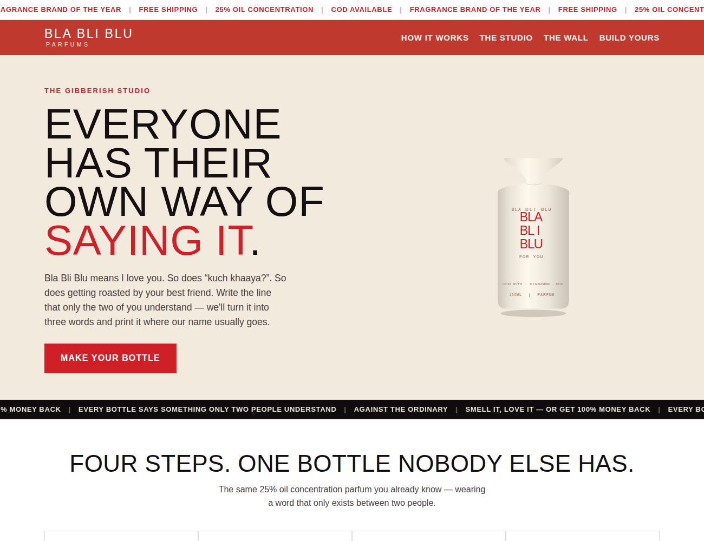
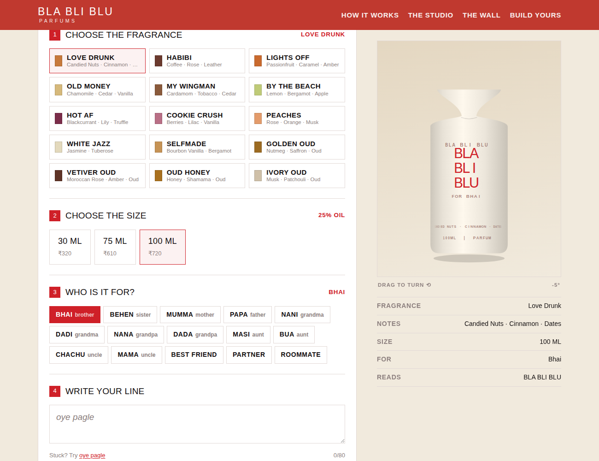

# Bla Bli Blu — The Words Studio

A working prototype of the personalisation engine for Case-O-Nova 8.0 (Team MU).

Everyone has their own way of saying "I love you". Pick a fragrance, pick a size, pick who it's for,
tell us about them — and the studio turns what you wrote into the three words that become their
version of it, printed on the bottle where BLA BLI BLU normally goes.




## Live demo

`https://sharmasambhav25.github.io/Bla-Bli-Blu/`

## Running it

It's a single file with no build step and no dependencies. Open `index.html` in a browser, or:

```
python3 -m http.server 8000
```

## Publishing changes

Push an updated `index.html` to the `main` branch of this repo — GitHub Pages redeploys
automatically within a minute or two.

## How the three words work

There's no invented gibberish anymore. The customer writes a few sentences about the person
they're gifting the bottle to, and gets back three real words that read like something you'd
actually say instead of "I love you" — pulled from what they wrote, not built from sound patterns.

Two engines run behind it:

- **Live model** — when the page is opened as a Claude Artifact, it reads the whole message and
  picks the three words that best capture the person, plus a one-line reason why.
- **Local engine** (`localWords()`) — a deterministic fallback with no model involved. It strips
  filler words (the, and, still, never, …) out of the message and keeps three distinct real words
  from what was actually written, spread across the message rather than clumped together. This is
  what runs on GitHub Pages, and it's also the fallback if the live model is unavailable, so a demo
  never breaks — it's just honest extraction instead of true understanding.

## Swapping in real product photography

The bottle is currently drawn in SVG, which is what lets the label text wrap around the glass and
change live. To use real photographs instead, drop transparent PNGs into `images/` and replace the
`renderBottle()` call in the stage with an `` plus an absolutely-positioned text overlay. The
label text is generated in one place (`renderBottle`), so this is a contained change.

## Structure

Everything is in `index.html`:

- `FRAGS` — the 15 live fragrances with notes, prices and whether they're in the oud range (oud ships
  in the red bottle, parfum in cream).
- `SIZES` — 30 / 75 / 100 ml with the price multipliers.
- `RELS` — the relationships, each with an example message about that person.
- `WALL` — the sample bottles on the "Everyone's got one" wall.
- `localWords()` — the offline three-words extraction engine.
- `renderBottle()` — the bottle, including the cylindrical label wrap.

## Note

This is a student concept prototype, not an official Bla Bli Blu property. Fragrance names, notes and
prices reflect the live range; the bottle artwork is an illustration.
